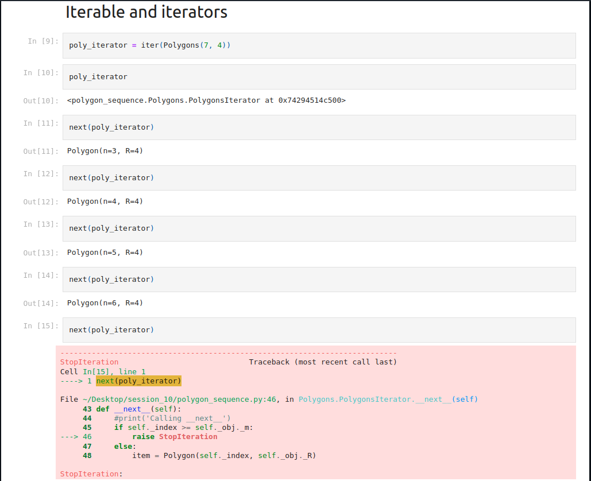

# epai5_iterable_iterators_part1
Refactoring the polygons sequence type into an interable

### Results
[iterators_iterables.ipynb](https://github.com/DimpleB0501/epai5_iterable_iterators_part1/blob/main/iterators_iterables.ipynb)

### Output

